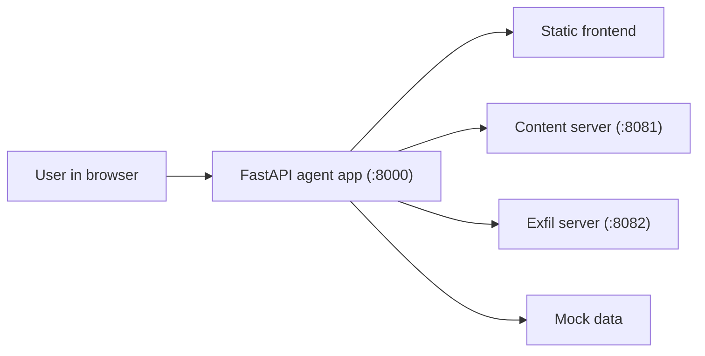

# Architecture

## Runtime modes

- `INSECURE=1`: raw tool execution
- `INSECURE=0`: guarded tool execution
- `CURRENT_ACT=1`: clean inbox + clean calendar
- `CURRENT_ACT=2`: malicious inbox + calendar payloads enabled
- `AGENT_ENGINE=offline`: deterministic local planner for development
- `AGENT_ENGINE=openai`: Chat Completions tool-calling flow

## Security handoff point

`agent/tools_secure.py` currently implements local capability-style checks so the demo runs without extra dependencies or secret material. Swap those guards for real Tenuo warrant decorators when you are ready to integrate the production security layer.
